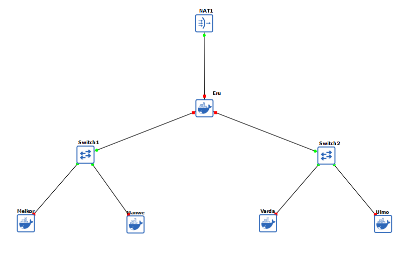

```
TEMPLATE /root/.bashrc
ERU:
apt update && apt install iptables -y
apt install unzip -y
apt-get install vsftpd -y
apt install netcat-traditional
apt install ftp -y
iptables -t nat -A POSTROUTING -o eth0 -j MASQUERADE -s 10.80.0.0/16
echo nameserver 192.168.122.1 > /etc/resolv.conf
```

```
CLIENT:
apt update && apt install iptables -y
apt install unzip -y
apt-get install vsftpd -y
apt install netcat-traditional -y
apt install ftp -y
echo nameserver 192.168.122.1 > /etc/resolv.conf
```

```
CONNECT TELNET:
telnet 10.15.43.32 {port router / client}
```

# Laporan Resmi Praktikum Jarkom 
## Walkthrough Pengerjaan Praktikum Jarkom Modul 1

## Anggota Kelompok
| No | Nama                       | NRP         |
|----|----------------------------|-------------|
| 1  | Aditya Reza Daffansyah     | 5027241034  |
| 2  | I Gede Bagus Saka Sinatrya |	5027241088  |


### Soal 1
#### Untuk mempersiapkan pembuatan entitas selain mereka, Eru yang berperan sebagai Router membuat dua Switch/Gateway. Dimana Switch 1 akan menuju ke dua Ainur yaitu Melkor dan Manwe. Sedangkan Switch 2 akan menuju ke dua Ainur lainnya yaitu Varda dan Ulmo. Keempat Ainur tersebut diberi perintah oleh Eru untuk menjadi Client.
##### Jawaban:
- Buat `NAT1`, `Eru (router)`, `1 switch` ke `client Melkor` dan `Manwe`, `1 switch` ke `Varda` dan `Ulmo`. 
- Hubungkan 'Eru' ke 'NAT1', 'Eru' ke 'Switch 1' dan 2. Hubungkan 'Switch 1' ke 'Melkor' dan 'Manwe', dan hubungkan 'Switch 2' ke 'Varda' dan 'Ulmo'




### Soal 2
- Sambungkan Eru (Router) ke NAT1 dengan network configure dibawah.
```
auto eth0
iface eth0 inet dhcp
```


- Gunakan `iptables -t nat -A POSTROUTING -o eth0 -j MASQUERADE -s 10.80.0.0/16` untuk menghubungkan router ke internet.

### Soal 3
hubungkan client satu sama lain (congfig satu persatu)
Eru:
auto eth1
iface eth1 inet static
    address 10.80.1.1
    netmask 255.255.255.0

auto eth2
iface eth2 inet static
    address 10.80.2.1
    netmask 255.255.255.0

Melkor:
auto eth0
iface eth0 inet static
    address 10.80.1.2
    netmask 255.255.255.0
    gateway [Prefix IP].1.1

Manwe:
auto eth0
iface eth0 inet static
    address 10.80.1.3
    netmask 255.255.255.0
    gateway 10.80.1.1

Varda:
auto eth0
iface eth0 inet static
    address 10.80.2.2
    netmask 255.255.255.0
    gateway 10.80.2.1

Ulmo:
auto eth0
iface eth0 inet static
    address 10.80.2.3
    netmask 255.255.255.0
    gateway 10.80.2.1

### Soal 4
echo nameserver 192.168.122.1 > /etc/resolv.conf (KE SEMUA CLIENT)


### Soal 5
masukkan config ke /root/.bashrc
ERU:
apt update && apt install -y iptables
apt-get install vsftpd -y
apt install netcat-traditional
apt install ftp -y
iptables -t nat -A POSTROUTING -o eth0 -j MASQUERADE -s 192.216.0.0/16
echo nameserver 192.168.122.1 > /etc/resolv.conf

CLIENT:
apt-get install vsftpd -y
apt install netcat-traditional
apt install ftp -y
echo nameserver 192.168.122.1 > /etc/resolv.conf


### Soal 6
 download file zip dari MANWE : wget --no-check-certificate "https://drive.google.com/uc?export=download&id=1bE3kF1Nclw0VyKq4bL2VtOOt53IC7lG5" -O traffic.zip
unzip: unzip traffic.zip

masuk ke dns3 app, capture manwe -> switch1 (make sure wireshark nya jalan). 

run traffic.sh di manwe, tunggu sampai proses selesai, stop wireshark, save capture, stop capture di GNS3

### Soal 7
Jalan di Eru:
apt install ftp -y
apt-get install vsftpd -y

Buat folder ftp, buat user ainur dan melkor:
mkdir -p /srv/ftp/shared
adduser ainur   
adduser melkor

Set folder yang akan di akses oleh ainur dan melkor
usermod -d /srv/ftp/shared ainur 
usermod -d /srv/ftp/shared melkor

Memberi akses owner ke ainur pada direktori /srv/ftp/shared
chown ainur:ainur /srv/ftp/shared

Memberi batasan akses ke tiga jenis user pada direktori /srv/ftp/shared
Owner: read write execute. Group: 0. Others: 0
chmod 700 /srv/ftp/shared

Edit vsftpd.conf sesuai kriteria dibawah:
nano /etc/vsftpd.conf

listen=YES
listen_ipv6=NO
anonymous_enable=NO
local_enable=YES
write_enable=YES
chroot_local_user=YES
allow_writeable_chroot=YES

Buat file untuk testing di local Eru
echo "akulelahjarkom" > testlocal.txt

Jalankan service vsftpd dan ftp ke localhost (10.80.1.1). whenever make changes -> do service vsftpd restart
service vsftpd start
ftp 10.80.1.1
login sebagai ainur

Buat file testing di ftp server
echo "akulelahjarkom" > testftp.txt

Tes put and get eru (read write)
put testftp.txt
get testlocal.txt

Tes user melkor
bye
service vsftpd start
ftp 10.80.1.1
login sebagai ainur

seharusnya tidak bisa akses ke direktori /srv/ftp/shared karena melkor tidak memiliki hak akses ke direktori tersebut

bye
service vsftpd stop

### Soal 8
di ulmo:
apt install ftp -y
apt install vsftpd -y

capture wireshark di ulmo -> switch 2

wget --no-check-certificate "https://drive.google.com/uc?export=download&id=11ra_yTV_adsPIXeIPMSt0vrxCBZu0r33" -O ramalan_cuaca
unzip ramalan_cuaca
ramalan cuaca contains: mendung.jpg dan cuaca.txt

di eru: 
service vsftpd start
+
di ulmo:
ftp 10.80.2.1
login as ainur
binary
put cuaca.txt
put mendung.jpg

di eru: cek ls apakah cuaca dan mendung ada


### Soal 9
di Eru:
wget -P /srv/ftp/shared "https://drive.google.com/uc?export=download&id=11ua2KgBu3MnHEIjhBnzqqv2RMEiJsILY"
unzip 

 
Edit vsftpd.conf sesuai kriteria dibawah:
nano /etc/vsftpd.conf

listen=YES
listen_ipv6=NO
anonymous_enable=NO
local_enable=YES
write_enable=NO
chroot_local_user=YES
allow_writeable_chroot=YES

capture wireshark di manwe -> switch 
service vsftpd start

di Manwe:
ftp 10.80.1.1
login as ainur
get kitab_penciptaan.zip (atau setelah di ekstrak)
delete kitab_penciptaan.zip (HARUSYA GABISA)

stop wireshark capture, cek dengan filter ftp || ftp-data


### Soal 10
di Melkor:
ping -c 100 10.80.1.1 (IP ERU)
Identifikasi hasilnya

### Soal 11
di Melkor:
apt install openbsd-inetd telnetd -y
adduser jarkomasix:jarkomasix

di GNS3: start capture wire eru dan melkor (switch1)

di Eru: telnet <ip>

stop wireshark, pake filter telnet, klik kanan pada salah satu target, klik follow > tcp stream (akan menampilkan convo eru dan 
melkor tanpa enkripsim, akan ditermukan usn dan huruf tanpa enkripsi)


### Soal 12
di Melkor:
apt install netcat-openbsd -y

service vsftpd start

3 port yang perlu di cek 21,80,dan 666
nc -vz 10.80.1.2 21

apt install apache2 -y
service apache2 start

nc -vz 10.80.1.2 80
nc -vz 10.80.1.2 666

jelaskan service port tersebut apaa dan terbuka atau tertutup


### Soal 13
di Eru:
apt update && apt install openssh-server -y
systemctl start ssh

varda -> switch, start capturing wireshark

di Varda: 
ssh <usn>@<IP_server>
ssh ainur@IP_ERU

di Wireshark:
hentikan capture, pakai filter ssh, klik kanan pada salah satu paket, follow, tcp stream


### 14. Setelah gagal mengakses FTP, Melkor melancarkan serangan brute force terhadap  Manwe. Analisis file capture yang disediakan dan identifikasi upaya brute force Melkor. (link file) nc 10.15.43.32 3401


### 15. Melkor menyusup ke ruang server dan memasang keyboard USB berbahaya pada node Manwe. Buka file capture dan identifikasi pesan atau ketikan (keystrokes) yang berhasil dicuri oleh Melkor untuk menemukan password rahasia. (link file) nc 10.15.43.32 3402


### 16. Melkor semakin murka ia meletakkan file berbahaya di server milik Manwe. Dari file capture yang ada, identifikasi file apa yang diletakkan oleh Melkor. (link file) nc 10.15.43.32 3403


### 17. Manwe membuat halaman web di node-nya yang menampilkan gambar cincin agung. Melkor yang melihat web tersebut merasa iri sehingga ia meletakkan file berbahaya agar web tersebut dapat dianggap menyebarkan malware oleh Eru. Analisis file capture untuk menggagalkan rencana Melkor dan menyelamatkan web Manwe. (link file) nc 10.15.43.32 3404


### 18. Karena rencana Melkor yang terus gagal, ia akhirnya berhenti sejenak untuk berpikir. Pada saat berpikir ia akhirnya memutuskan untuk membuat rencana jahat lainnya dengan meletakkan file berbahaya lagi tetapi dengan metode yang berbeda. Gagalkan lagi rencana Melkor dengan mengidentifikasi file capture yang disediakan agar dunia tetap aman. (link file) nc 10.15.43.32 3405


### 19. Manwe mengirimkan email berisi surat cinta kepada Varda melalui koneksi yang tidak terenkripsi. Melihat hal itu Melkor sipaling jahat langsung melancarkan 
aksinya yaitu meneror Varda dengan email yang disamarkan. Analisis file capture jaringan dan gagalkan lagi rencana busuk Melkor.  (link file) nc 10.15.43.32 3406


### 20. Untuk yang terakhir kalinya, rencana besar Melkor yaitu menanamkan sebuah file berbahaya kemudian menyembunyikannya agar tidak terlihat oleh Eru. Tetapi Manwe yang sudah merasakan adanya niat jahat dari Melkor, ia menyisipkan bantuan untuk mengungkapkan rencana Melkor. Analisis file capture dan identifikasi kegunaan bantuan yang diberikan oleh Manwe untuk menggagalkan rencana jahat Melkor selamanya. (link file) nc 10.15.43.32 3407


